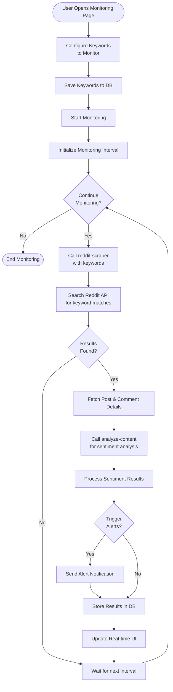

# Activity Diagrams - Reddit Sleuth

## User Profiling Activity Flow

This diagram shows the complete workflow for analyzing a Reddit user profile.

```mermaid
flowchart TD
    Start([User Opens User Profiling Page])
    
    Start --> Input[Enter Reddit Username]
    Input --> Scrape[Click Scrape Button]
    
    Scrape --> Auth{Authenticated?}
    Auth -->|No| Login[Redirect to Login]
    Login --> Auth
    Auth -->|Yes| CallScraper[Call reddit-scraper<br/>Edge Function]
    
    CallScraper --> RedditAuth[Authenticate with<br/>Reddit API OAuth2]
    RedditAuth --> FetchUser[Fetch User Profile Data]
    FetchUser --> FetchPosts[Fetch User's Posts<br/>(up to 10)]
    FetchPosts --> FetchComments[Fetch User's Comments<br/>(up to 15)]
    
    FetchComments --> CheckData{Data<br/>Retrieved?}
    CheckData -->|No| ShowError[Display Error Message]
    ShowError --> End([End])
    
    CheckData -->|Yes| DisplayBasic[Display Basic Profile Info<br/>(karma, account age, etc.)]
    DisplayBasic --> CallAnalyze[Call analyze-content<br/>Edge Function]
    
    CallAnalyze --> PrepareData[Prepare Posts & Comments<br/>for AI Analysis]
    PrepareData --> AISentiment[AI: Analyze Sentiment<br/>per Post & Comment]
    
    AISentiment --> AILocation[AI: Extract Location Data]
    AILocation --> AIPatterns[AI: Identify Behavior Patterns]
    
    AIPatterns --> ProcessResults[Process AI Results]
    ProcessResults --> CreateCharts[Create Sentiment Charts<br/>(Posts & Comments)]
    CreateCharts --> DisplayTables[Display Tables with<br/>Text, Sentiment & XAI]
    
    DisplayTables --> StoreDB[Store Results in Database]
    StoreDB --> DisplayComplete[Display Complete Analysis]
    DisplayComplete --> End
```

## Content Monitoring Activity Flow



## Case Management Activity Flow

```mermaid
flowchart TD
    Start([User Wants to Create Case])
    
    Start --> NewCase[Navigate to New Case Page]
    NewCase --> FillDetails[Fill Case Details<br/>(title, description, etc.)]
    FillDetails --> SelectType[Select Investigation Type<br/>(User/Community/Link)]
    
    SelectType --> AddTargets[Add Target Usernames/<br/>Subreddits/Links]
    AddTargets --> SetKeywords[Set Monitoring Keywords]
    SetKeywords --> ConfigAlerts[Configure Alerts]
    
    ConfigAlerts --> Review[Review Case Configuration]
    Review --> Confirm{Confirm<br/>Creation?}
    
    Confirm -->|No| EditDetails[Edit Details]
    EditDetails --> Review
    
    Confirm -->|Yes| SaveCase[Save Case to Database]
    SaveCase --> InitScraping[Initialize Scraping for Targets]
    
    InitScraping --> StartAnalysis[Start AI Analysis]
    StartAnalysis --> GenerateReport[Generate Initial Report]
    GenerateReport --> DisplayDashboard[Display Case Dashboard]
    
    DisplayDashboard --> Monitor[Monitor Case Progress]
    Monitor --> UpdateCheck{Updates<br/>Available?}
    
    UpdateCheck -->|Yes| RefreshData[Refresh Analysis Data]
    RefreshData --> Monitor
    
    UpdateCheck -->|No| UserAction{User<br/>Action?}
    UserAction -->|Export| ExportData[Export Case Data]
    ExportData --> Monitor
    
    UserAction -->|Close Case| CloseCase[Mark Case as Closed]
    CloseCase --> End([End])
    
    UserAction -->|Continue| Monitor
```

## Link Analysis Activity Flow

```mermaid
flowchart TD
    Start([User Opens Link Analysis])
    
    Start --> InputLinks[Enter Links to Track]
    InputLinks --> ValidateLinks{Valid<br/>Links?}
    
    ValidateLinks -->|No| ShowValidationError[Show Validation Error]
    ShowValidationError --> InputLinks
    
    ValidateLinks -->|Yes| CallScraper[Call reddit-scraper<br/>to search for links]
    CallScraper --> SearchPosts[Search Posts containing links]
    SearchPosts --> SearchComments[Search Comments containing links]
    
    SearchComments --> AggregateData[Aggregate Link Data<br/>(count, posts, comments)]
    AggregateData --> AnalyzeSpread[Analyze Link Spread<br/>across subreddits]
    
    AnalyzeSpread --> IdentifyUsers[Identify Users sharing links]
    IdentifyUsers --> CallAnalyze[Call analyze-content<br/>for context analysis]
    
    CallAnalyze --> DetectPatterns[Detect Sharing Patterns<br/>(spam, coordinated, etc.)]
    DetectPatterns --> CreateNetwork[Create Network Graph<br/>of link relationships]
    
    CreateNetwork --> GenerateMetrics[Generate Link Metrics<br/>(velocity, reach, sentiment)]
    GenerateMetrics --> DisplayResults[Display Link Analysis Results]
    
    DisplayResults --> UserOption{User<br/>Option?}
    UserOption -->|Export| ExportAnalysis[Export Analysis]
    ExportAnalysis --> End([End])
    
    UserOption -->|New Analysis| InputLinks
    UserOption -->|Close| End
```
