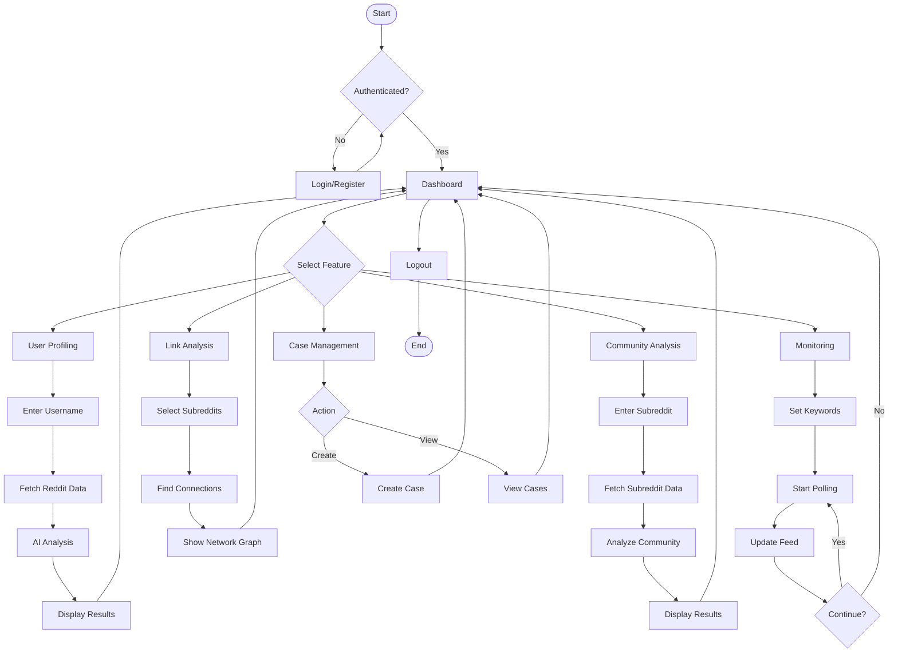

# Activity Diagram - Reddit Sleuth

## Complete System Flow

```mermaid
flowchart TD
    Start([Start]) --> Login{Authenticated?}
    Login -->|No| Auth[Login/Register]
    Auth --> Login
    Login -->|Yes| Dashboard[Dashboard]
    
    Dashboard --> Module{Select Feature}
    
    Module --> UserProfile[User Profiling]
    Module --> Community[Community Analysis]
    Module --> Link[Link Analysis]
    Module --> Monitor[Monitoring]
    Module --> Case[Case Management]
    
    UserProfile --> EnterUser[Enter Username]
    EnterUser --> FetchUser[Fetch Reddit Data]
    FetchUser --> AnalyzeUser[AI Analysis]
    AnalyzeUser --> DisplayUser[Display Results]
    DisplayUser --> Dashboard
    
    Community --> EnterSub[Enter Subreddit]
    EnterSub --> FetchSub[Fetch Subreddit Data]
    FetchSub --> AnalyzeSub[Analyze Community]
    AnalyzeSub --> DisplaySub[Display Results]
    DisplaySub --> Dashboard
    
    Link --> SelectSubs[Select Subreddits]
    SelectSubs --> FindLinks[Find Connections]
    FindLinks --> ShowNetwork[Show Network Graph]
    ShowNetwork --> Dashboard
    
    Monitor --> SetKeywords[Set Keywords]
    SetKeywords --> StartPoll[Start Polling]
    StartPoll --> UpdateFeed[Update Feed]
    UpdateFeed --> Continue{Continue?}
    Continue -->|Yes| StartPoll
    Continue -->|No| Dashboard
    
    Case --> CaseAction{Action}
    CaseAction -->|Create| NewCase[Create Case]
    CaseAction -->|View| ViewCase[View Cases]
    NewCase --> Dashboard
    ViewCase --> Dashboard
    
    Dashboard --> Logout[Logout]
    Logout --> End([End])
```
