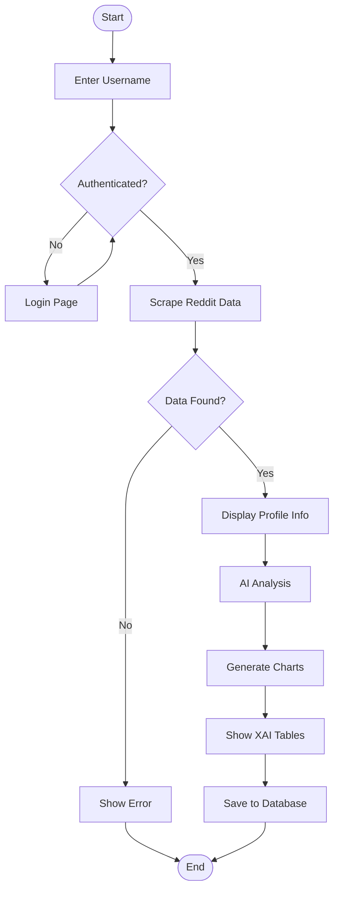
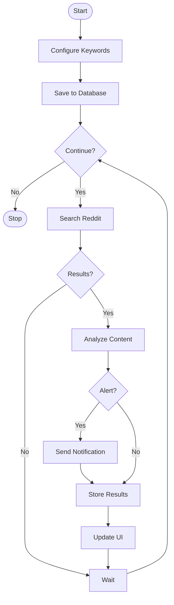
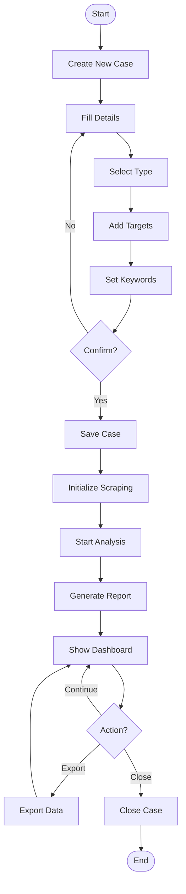
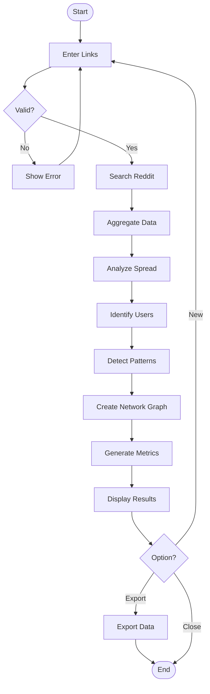

# Activity Diagrams - Reddit Sleuth

## User Profiling Activity Flow

```mermaid
flowchart TD
    Start([Start]) --> Input[Enter Username]
    Input --> Auth{Authenticated?}
    Auth -->|No| Login[Login Page]
    Login --> Auth
    Auth -->|Yes| Scrape[Scrape Reddit Data]
    
    Scrape --> Check{Data Found?}
    Check -->|No| Error[Show Error]
    Error --> End([End])
    
    Check -->|Yes| Display[Display Profile Info]
    Display --> Analyze[AI Analysis]
    Analyze --> Charts[Generate Charts]
    Charts --> Tables[Show XAI Tables]
    Tables --> Save[Save to Database]
    Save --> End
```

## Content Monitoring Activity Flow

```mermaid
flowchart TD
    Start([Start]) --> Config[Configure Keywords]
    Config --> Save[Save to Database]
    Save --> Monitor{Continue?}
    
    Monitor -->|No| Stop([Stop])
    Monitor -->|Yes| Search[Search Reddit]
    
    Search --> Found{Results?}
    Found -->|No| Wait[Wait]
    Wait --> Monitor
    
    Found -->|Yes| Analyze[Analyze Content]
    Analyze --> Alert{Alert?}
    Alert -->|Yes| Notify[Send Notification]
    Notify --> Store[Store Results]
    Alert -->|No| Store
    Store --> Update[Update UI]
    Update --> Wait
```

## Case Management Activity Flow

```mermaid
flowchart TD
    Start([Start]) --> Create[Create New Case]
    Create --> Details[Fill Details]
    Details --> Type[Select Type]
    Type --> Targets[Add Targets]
    Targets --> Keywords[Set Keywords]
    Keywords --> Confirm{Confirm?}
    
    Confirm -->|No| Details
    Confirm -->|Yes| Save[Save Case]
    Save --> Init[Initialize Scraping]
    Init --> Analyze[Start Analysis]
    Analyze --> Report[Generate Report]
    Report --> Dashboard[Show Dashboard]
    
    Dashboard --> Action{Action?}
    Action -->|Export| Export[Export Data]
    Export --> Dashboard
    Action -->|Close| Close[Close Case]
    Close --> End([End])
    Action -->|Continue| Dashboard
```

## Link Analysis Activity Flow

```mermaid
flowchart TD
    Start([Start]) --> Input[Enter Links]
    Input --> Validate{Valid?}
    
    Validate -->|No| Error[Show Error]
    Error --> Input
    
    Validate -->|Yes| Search[Search Reddit]
    Search --> Aggregate[Aggregate Data]
    Aggregate --> Spread[Analyze Spread]
    Spread --> Users[Identify Users]
    Users --> Patterns[Detect Patterns]
    Patterns --> Network[Create Network Graph]
    Network --> Metrics[Generate Metrics]
    Metrics --> Display[Display Results]
    
    Display --> Option{Option?}
    Option -->|Export| Export[Export Data]
    Export --> End([End])
    Option -->|New| Input
    Option -->|Close| End
```
