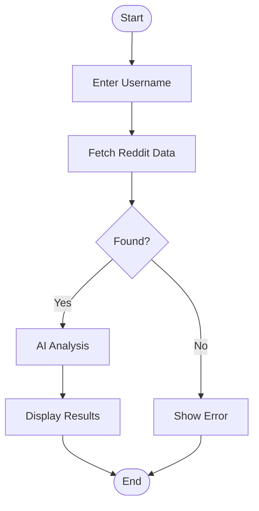
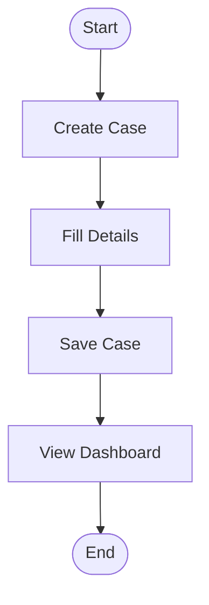
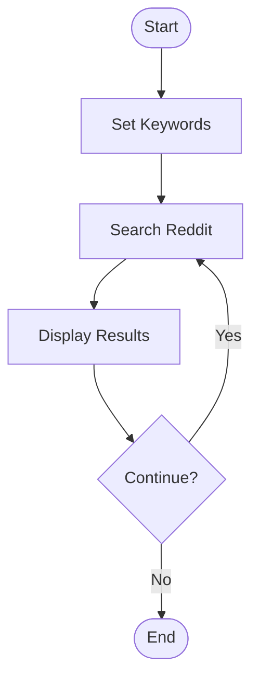

# Activity Diagrams - Reddit Sleuth

## User Profiling

```mermaid
flowchart TD
    Start([Start]) --> Input[Enter Username]
    Input --> Fetch[Fetch Reddit Data]
    Fetch --> Check{Found?}
    Check -->|No| Error[Show Error]
    Check -->|Yes| Analyze[AI Analysis]
    Analyze --> Display[Display Results]
    Display --> End([End])
    Error --> End
```

## Case Management

```mermaid
flowchart TD
    Start([Start]) --> Create[Create Case]
    Create --> Details[Fill Details]
    Details --> Save[Save Case]
    Save --> Dashboard[View Dashboard]
    Dashboard --> End([End])
```

## Monitoring

```mermaid
flowchart TD
    Start([Start]) --> Config[Set Keywords]
    Config --> Search[Search Reddit]
    Search --> Display[Display Results]
    Display --> Continue{Continue?}
    Continue -->|Yes| Search
    Continue -->|No| End([End])
```
