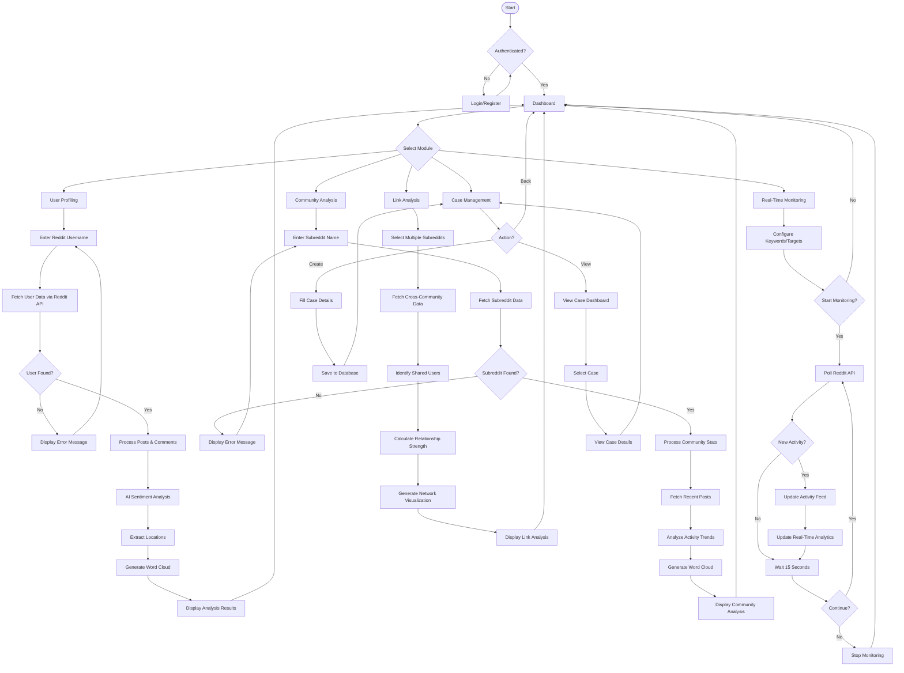
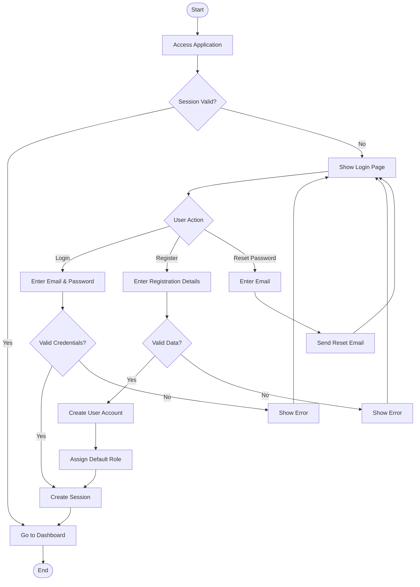
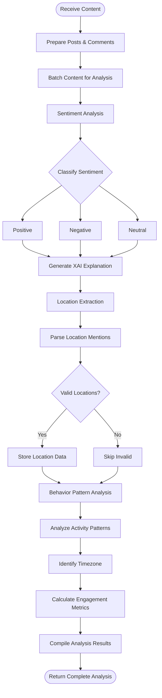
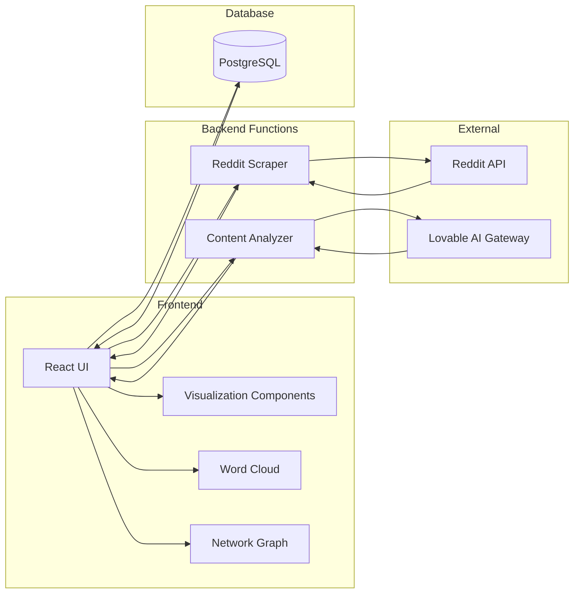

# Activity Diagrams - Reddit Sleuth

## Complete System Activity Diagram

```mermaid
flowchart TD
    Start([Start]) --> Login{Authenticated?}
    Login -->|No| AuthFlow[Login/Register]
    AuthFlow --> Login
    Login -->|Yes| Dashboard[Dashboard]
    
    Dashboard --> SelectModule{Select Module}
    
    SelectModule --> UserProfiling[User Profiling]
    SelectModule --> CommunityAnalysis[Community Analysis]
    SelectModule --> LinkAnalysis[Link Analysis]
    SelectModule --> Monitoring[Real-Time Monitoring]
    SelectModule --> CaseManagement[Case Management]
    
    %% User Profiling Flow
    UserProfiling --> EnterUsername[Enter Reddit Username]
    EnterUsername --> FetchUserData[Fetch User Data via Reddit API]
    FetchUserData --> UserFound{User Found?}
    UserFound -->|No| UserError[Display Error Message]
    UserError --> EnterUsername
    UserFound -->|Yes| ProcessUserData[Process Posts & Comments]
    ProcessUserData --> AIAnalysis[AI Sentiment Analysis]
    AIAnalysis --> ExtractLocations[Extract Locations]
    ExtractLocations --> GenerateWordCloud[Generate Word Cloud]
    GenerateWordCloud --> DisplayUserResults[Display Analysis Results]
    DisplayUserResults --> Dashboard
    
    %% Community Analysis Flow
    CommunityAnalysis --> EnterSubreddit[Enter Subreddit Name]
    EnterSubreddit --> FetchCommunityData[Fetch Subreddit Data]
    FetchCommunityData --> CommunityFound{Subreddit Found?}
    CommunityFound -->|No| CommunityError[Display Error Message]
    CommunityError --> EnterSubreddit
    CommunityFound -->|Yes| ProcessCommunityData[Process Community Stats]
    ProcessCommunityData --> FetchRecentPosts[Fetch Recent Posts]
    FetchRecentPosts --> AnalyzeCommunityTrends[Analyze Activity Trends]
    AnalyzeCommunityTrends --> GenerateCommunityWordCloud[Generate Word Cloud]
    GenerateCommunityWordCloud --> DisplayCommunityResults[Display Community Analysis]
    DisplayCommunityResults --> Dashboard
    
    %% Link Analysis Flow
    LinkAnalysis --> SelectSubreddits[Select Multiple Subreddits]
    SelectSubreddits --> FetchCrossData[Fetch Cross-Community Data]
    FetchCrossData --> IdentifySharedUsers[Identify Shared Users]
    IdentifySharedUsers --> CalculateRelationships[Calculate Relationship Strength]
    CalculateRelationships --> GenerateNetworkGraph[Generate Network Visualization]
    GenerateNetworkGraph --> DisplayNetworkResults[Display Link Analysis]
    DisplayNetworkResults --> Dashboard
    
    %% Monitoring Flow
    Monitoring --> ConfigureMonitoring[Configure Keywords/Targets]
    ConfigureMonitoring --> StartMonitoring{Start Monitoring?}
    StartMonitoring -->|Yes| PollReddit[Poll Reddit API]
    PollReddit --> CheckNewActivity{New Activity?}
    CheckNewActivity -->|Yes| UpdateFeed[Update Activity Feed]
    UpdateFeed --> UpdateAnalytics[Update Real-Time Analytics]
    CheckNewActivity -->|No| Wait15Sec[Wait 15 Seconds]
    UpdateAnalytics --> Wait15Sec
    Wait15Sec --> ContinueMonitoring{Continue?}
    ContinueMonitoring -->|Yes| PollReddit
    ContinueMonitoring -->|No| StopMonitoring[Stop Monitoring]
    StartMonitoring -->|No| Dashboard
    StopMonitoring --> Dashboard
    
    %% Case Management Flow
    CaseManagement --> CaseAction{Action?}
    CaseAction -->|Create| CreateCase[Fill Case Details]
    CreateCase --> SaveCase[Save to Database]
    SaveCase --> CaseManagement
    CaseAction -->|View| ViewCases[View Case Dashboard]
    ViewCases --> SelectCase[Select Case]
    SelectCase --> ViewCaseDetails[View Case Details]
    ViewCaseDetails --> CaseManagement
    CaseAction -->|Back| Dashboard
```

## User Authentication Flow

```mermaid
flowchart TD
    Start([Start]) --> AccessApp[Access Application]
    AccessApp --> CheckSession{Session Valid?}
    CheckSession -->|Yes| Dashboard[Go to Dashboard]
    CheckSession -->|No| ShowLogin[Show Login Page]
    
    ShowLogin --> UserAction{User Action}
    UserAction -->|Login| EnterCredentials[Enter Email & Password]
    UserAction -->|Register| EnterRegistration[Enter Registration Details]
    UserAction -->|Reset Password| EnterEmail[Enter Email]
    
    EnterCredentials --> ValidateLogin{Valid Credentials?}
    ValidateLogin -->|Yes| CreateSession[Create Session]
    ValidateLogin -->|No| ShowLoginError[Show Error]
    ShowLoginError --> ShowLogin
    
    EnterRegistration --> ValidateRegistration{Valid Data?}
    ValidateRegistration -->|Yes| CreateUser[Create User Account]
    CreateUser --> AssignRole[Assign Default Role]
    AssignRole --> CreateSession
    ValidateRegistration -->|No| ShowRegError[Show Error]
    ShowRegError --> ShowLogin
    
    EnterEmail --> SendResetLink[Send Reset Email]
    SendResetLink --> ShowLogin
    
    CreateSession --> Dashboard
    Dashboard --> End([End])
```

## AI Analysis Pipeline

```mermaid
flowchart TD
    Start([Receive Content]) --> PrepareContent[Prepare Posts & Comments]
    PrepareContent --> BatchContent[Batch Content for Analysis]
    
    BatchContent --> SentimentAnalysis[Sentiment Analysis]
    SentimentAnalysis --> ClassifySentiment{Classify Sentiment}
    ClassifySentiment --> Positive[Positive]
    ClassifySentiment --> Negative[Negative]
    ClassifySentiment --> Neutral[Neutral]
    
    Positive --> GenerateXAI[Generate XAI Explanation]
    Negative --> GenerateXAI
    Neutral --> GenerateXAI
    
    GenerateXAI --> LocationExtraction[Location Extraction]
    LocationExtraction --> ParseLocations[Parse Location Mentions]
    ParseLocations --> GeoValidation{Valid Locations?}
    GeoValidation -->|Yes| StoreLocations[Store Location Data]
    GeoValidation -->|No| SkipLocation[Skip Invalid]
    
    StoreLocations --> PatternAnalysis[Behavior Pattern Analysis]
    SkipLocation --> PatternAnalysis
    
    PatternAnalysis --> AnalyzeActivity[Analyze Activity Patterns]
    AnalyzeActivity --> IdentifyTimezone[Identify Timezone]
    IdentifyTimezone --> CalculateMetrics[Calculate Engagement Metrics]
    
    CalculateMetrics --> CompileResults[Compile Analysis Results]
    CompileResults --> ReturnResults([Return Complete Analysis])
```

## Data Flow Overview

```mermaid
flowchart LR
    subgraph Frontend
        UI[React UI]
        Charts[Visualization Components]
        WordCloud[Word Cloud]
        NetworkGraph[Network Graph]
    end
    
    subgraph EdgeFunctions[Backend Functions]
        Scraper[Reddit Scraper]
        Analyzer[Content Analyzer]
    end
    
    subgraph External
        RedditAPI[Reddit API]
        AI[Lovable AI Gateway]
    end
    
    subgraph Database
        Supabase[(PostgreSQL)]
    end
    
    UI --> Scraper
    Scraper --> RedditAPI
    RedditAPI --> Scraper
    Scraper --> UI
    
    UI --> Analyzer
    Analyzer --> AI
    AI --> Analyzer
    Analyzer --> UI
    
    UI --> Supabase
    Supabase --> UI
    
    UI --> Charts
    UI --> WordCloud
    UI --> NetworkGraph
```
