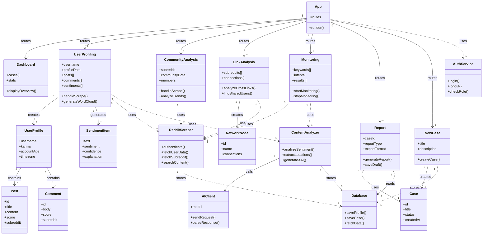

# Class Diagram - Reddit Sleuth

This diagram shows all classes and their relationships.

## Legend

| Arrow | Meaning |
|-------|---------|
| `-->` | Association (owns/creates) |
| `..>` | Dependency (uses) |

## Multiplicity

| Symbol | Meaning |
|--------|---------|
| `1` | Exactly one |
| `*` | Zero or more |

## Components

### Frontend Pages
| Component | Description |
|-----------|-------------|
| **App** | Main router with authentication |
| **Dashboard** | Case overview and statistics |
| **UserProfiling** | Reddit user analysis with sentiment |
| **CommunityAnalysis** | Subreddit statistics and trends |
| **LinkAnalysis** | Cross-community connections |
| **Monitoring** | Real-time keyword tracking |
| **Report** | Generate PDF/HTML reports |
| **NewCase** | Create investigation cases |

### Data Models
| Model | Description |
|-------|-------------|
| **UserProfile** | Reddit user data |
| **Post/Comment** | Reddit content |
| **SentimentItem** | AI sentiment result with XAI |
| **NetworkNode** | Graph visualization node |
| **Case** | Investigation case data |

### Services
| Service | Description |
|---------|-------------|
| **RedditScraper** | Reddit API integration |
| **ContentAnalyzer** | AI sentiment analysis |
| **AIClient** | Lovable AI (Gemini 2.5 Flash) |
| **Database** | Data persistence |
| **AuthService** | User authentication |
