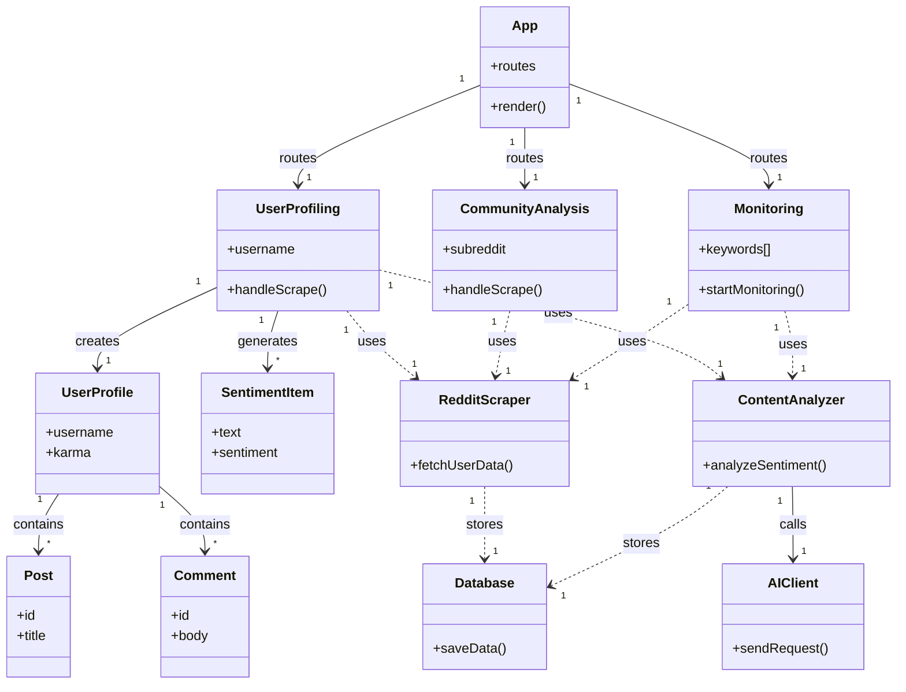

# Class Diagram - Reddit Sleuth

This diagram shows the main classes and their relationships.

## Legend

| Arrow Type | Meaning |
|------------|---------|
| `-->` | Association |
| `..>` | Dependency (uses) |

## Multiplicity

| Symbol | Meaning |
|--------|---------|
| `1` | Exactly one |
| `*` | Zero or more |

## Components

### Frontend Pages
- **App**: Main router
- **UserProfiling**: Reddit user analysis
- **CommunityAnalysis**: Subreddit analysis
- **Monitoring**: Real-time alerts

### Data Models
- **UserProfile**: User data
- **Post/Comment**: Reddit content
- **SentimentItem**: AI analysis result

### Services
- **RedditScraper**: Reddit API
- **ContentAnalyzer**: AI processing
- **AIClient**: Lovable AI
- **Database**: Data storage
