# Class Diagram - Reddit Sleuth

This diagram shows the main classes/components and their relationships in the Reddit Sleuth application.

```mermaid
classDiagram
    %% Frontend Components
    class App {
        +Router routes
        +render()
    }
    
    class Dashboard {
        +stats: DashboardStats
        +cases: Case[]
        +render()
    }
    
    class UserProfiling {
        +username: string
        +profileData: UserProfile
        +postSentiments: SentimentItem[]
        +commentSentiments: SentimentItem[]
        +handleScrape()
        +handleAnalysis()
        +render()
    }
    
    class CommunityAnalysis {
        +subreddit: string
        +communityData: CommunityData
        +handleScrape()
        +render()
    }
    
    class LinkAnalysis {
        +links: string[]
        +linkData: LinkData
        +networkGraph: NetworkNode[]
        +handleSearch()
        +render()
    }
    
    class Monitoring {
        +keywords: string[]
        +monitoringData: MonitoringResult[]
        +alerts: Alert[]
        +startMonitoring()
        +stopMonitoring()
        +render()
    }
    
    class NewCase {
        +caseDetails: CaseDetails
        +createCase()
        +render()
    }
    
    class Report {
        +reportData: ReportData
        +generateReport()
        +exportReport()
        +render()
    }
    
    %% Data Models
    class UserProfile {
        +username: string
        +karma: number
        +accountAge: number
        +posts: Post[]
        +comments: Comment[]
        +sentimentBreakdown: SentimentBreakdown
    }
    
    class SentimentItem {
        +text: string
        +sentiment: string
        +explanation: string
        +confidence: number
    }
    
    class SentimentBreakdown {
        +positive: number
        +negative: number
        +neutral: number
    }
    
    class Post {
        +id: string
        +title: string
        +content: string
        +subreddit: string
        +score: number
        +created_at: date
        +url: string
    }
    
    class Comment {
        +id: string
        +body: string
        +post_id: string
        +subreddit: string
        +score: number
        +created_at: date
    }
    
    class CommunityData {
        +name: string
        +subscribers: number
        +description: string
        +posts: Post[]
        +topContributors: User[]
        +sentimentTrends: SentimentBreakdown
    }
    
    class LinkData {
        +url: string
        +shareCount: number
        +posts: Post[]
        +comments: Comment[]
        +sharingUsers: User[]
        +subreddits: string[]
    }
    
    class MonitoringResult {
        +id: string
        +keyword: string
        +content: Post | Comment
        +sentiment: string
        +timestamp: date
        +alertTriggered: boolean
    }
    
    class Alert {
        +id: string
        +type: string
        +message: string
        +severity: string
        +timestamp: date
        +acknowledged: boolean
    }
    
    class Case {
        +id: string
        +title: string
        +description: string
        +type: string
        +status: string
        +created_at: date
        +targets: string[]
        +keywords: string[]
    }
    
    %% Backend Services
    class RedditScraperService {
        +clientId: string
        +clientSecret: string
        +authenticate()
        +fetchUserData(username: string): UserProfile
        +fetchSubredditData(subreddit: string): CommunityData
        +searchContent(query: string): SearchResult[]
    }
    
    class AnalyzeContentService {
        +apiKey: string
        +analyzeSentiment(content: string[]): SentimentResult
        +extractLocations(content: string[]): Location[]
        +identifyPatterns(content: string[]): Pattern[]
    }
    
    class LovableAIClient {
        +model: string
        +apiEndpoint: string
        +sendRequest(prompt: string): AIResponse
    }
    
    class SupabaseClient {
        +url: string
        +anonKey: string
        +auth: AuthService
        +from(table: string): QueryBuilder
        +storage: StorageService
    }
    
    class DatabaseService {
        +supabase: SupabaseClient
        +saveUserProfile(profile: UserProfile)
        +saveCommunityData(data: CommunityData)
        +saveCase(case: Case)
        +saveMonitoringResult(result: MonitoringResult)
        +fetchCases(): Case[]
    }
    
    %% Authentication
    class AuthService {
        +supabase: SupabaseClient
        +signIn(email: string, password: string)
        +signUp(email: string, password: string)
        +signOut()
        +getCurrentUser(): User
    }
    
    class User {
        +id: string
        +email: string
        +role: string
        +created_at: date
    }
    
    %% UI Components
    class AnalyticsChart {
        +data: ChartData[]
        +type: string
        +render()
    }
    
    class NetworkVisualization {
        +nodes: NetworkNode[]
        +edges: NetworkEdge[]
        +render()
    }
    
    class WordCloud {
        +words: WordData[]
        +render()
    }
    
    %% Relationships
    App --> Dashboard
    App --> UserProfiling
    App --> CommunityAnalysis
    App --> LinkAnalysis
    App --> Monitoring
    App --> NewCase
    App --> Report
    
    UserProfiling --> UserProfile
    UserProfiling --> SentimentItem
    UserProfiling --> RedditScraperService
    UserProfiling --> AnalyzeContentService
    UserProfiling --> AnalyticsChart
    
    CommunityAnalysis --> CommunityData
    CommunityAnalysis --> RedditScraperService
    CommunityAnalysis --> WordCloud
    
    LinkAnalysis --> LinkData
    LinkAnalysis --> NetworkVisualization
    LinkAnalysis --> RedditScraperService
    
    Monitoring --> MonitoringResult
    Monitoring --> Alert
    Monitoring --> RedditScraperService
    Monitoring --> AnalyzeContentService
    
    Dashboard --> Case
    NewCase --> Case
    Report --> Case
    
    UserProfile --> Post
    UserProfile --> Comment
    UserProfile --> SentimentBreakdown
    
    SentimentItem --> SentimentBreakdown
    
    CommunityData --> Post
    CommunityData --> User
    
    LinkData --> Post
    LinkData --> Comment
    LinkData --> User
    
    RedditScraperService --> UserProfile
    RedditScraperService --> CommunityData
    
    AnalyzeContentService --> LovableAIClient
    AnalyzeContentService --> SentimentItem
    
    DatabaseService --> SupabaseClient
    DatabaseService --> UserProfile
    DatabaseService --> CommunityData
    DatabaseService --> Case
    DatabaseService --> MonitoringResult
    
    AuthService --> SupabaseClient
    AuthService --> User
    
    App --> AuthService
    App --> DatabaseService
```

## Component Descriptions

### Frontend Components
- **App**: Main application component with routing
- **Dashboard**: Overview of cases and statistics
- **UserProfiling**: Analyzes Reddit user behavior with sentiment analysis
- **CommunityAnalysis**: Analyzes subreddit communities
- **LinkAnalysis**: Tracks and analyzes link relationships
- **Monitoring**: Real-time content monitoring with alerts
- **NewCase**: Creates new investigation cases
- **Report**: Generates and displays reports

### Data Models
- **UserProfile**: Reddit user data with posts and comments
- **SentimentItem**: Individual sentiment analysis result with XAI explanation
- **Post/Comment**: Reddit content items
- **Case**: Investigation case data
- **MonitoringResult**: Real-time monitoring data
- **Alert**: System alerts for monitoring

### Backend Services
- **RedditScraperService**: Handles Reddit API interactions (OAuth2, data fetching)
- **AnalyzeContentService**: Manages AI content analysis
- **LovableAIClient**: Interface to Lovable AI (Gemini 2.5 Flash)
- **DatabaseService**: Handles database operations
- **AuthService**: Manages user authentication

### UI Components
- **AnalyticsChart**: Recharts-based visualization
- **NetworkVisualization**: Force-directed graph visualization
- **WordCloud**: Word frequency visualization
