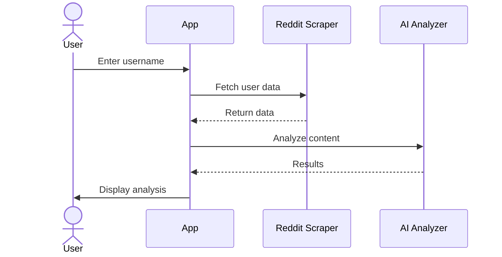
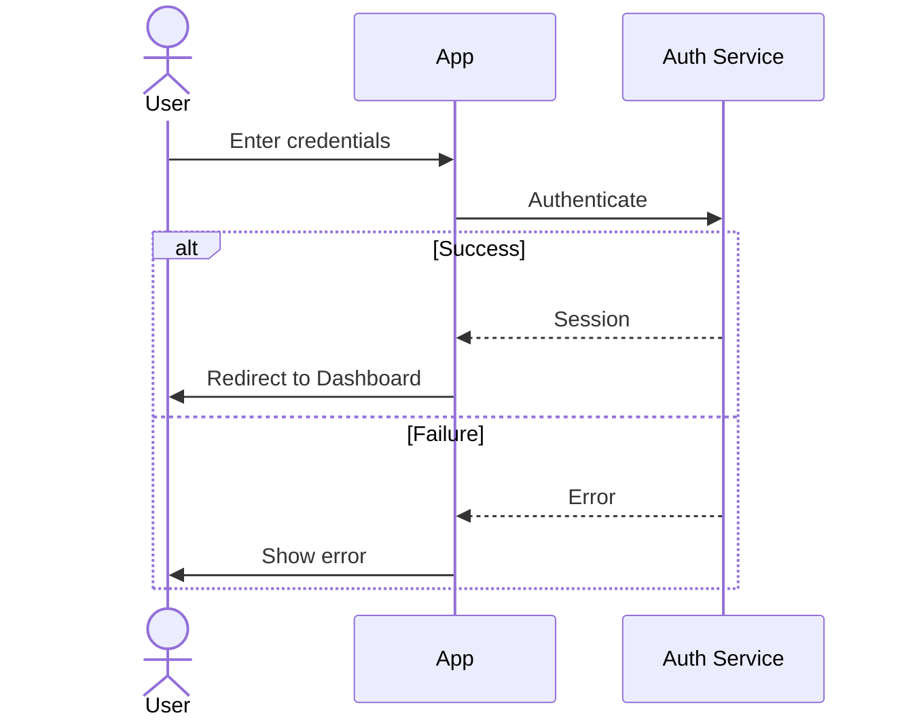
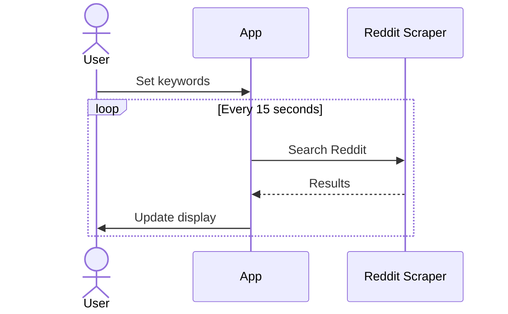

# Sequence Diagrams - Reddit Sleuth

## User Profiling Flow

```mermaid
sequenceDiagram
    actor User
    participant App
    participant Scraper as Reddit Scraper
    participant Analyzer as AI Analyzer
    
    User->>App: Enter username
    App->>Scraper: Fetch user data
    Scraper-->>App: Return data
    App->>Analyzer: Analyze content
    Analyzer-->>App: Results
    App->>User: Display analysis
```

## Authentication Flow

```mermaid
sequenceDiagram
    actor User
    participant App
    participant Auth as Auth Service
    
    User->>App: Enter credentials
    App->>Auth: Authenticate
    alt Success
        Auth-->>App: Session
        App->>User: Redirect to Dashboard
    else Failure
        Auth-->>App: Error
        App->>User: Show error
    end
```

## Monitoring Flow

```mermaid
sequenceDiagram
    actor User
    participant App
    participant Scraper as Reddit Scraper
    
    User->>App: Set keywords
    loop Every 15 seconds
        App->>Scraper: Search Reddit
        Scraper-->>App: Results
        App->>User: Update display
    end
```
