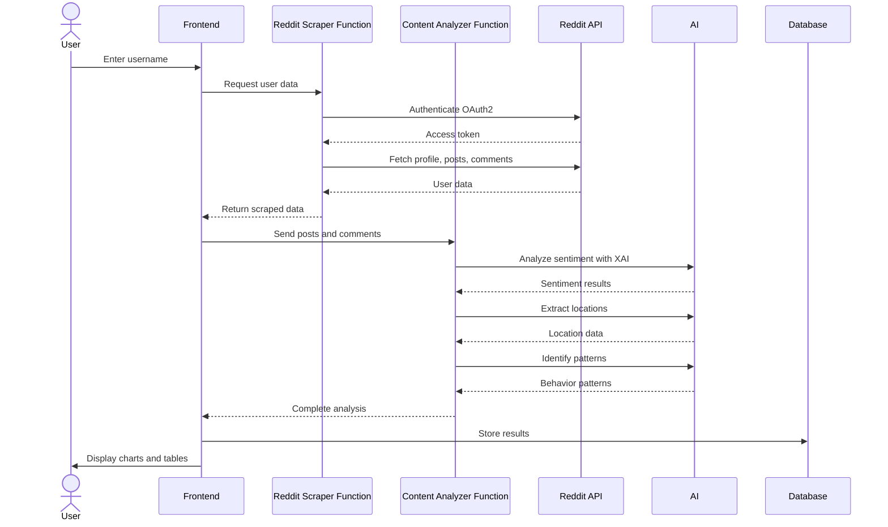

# Sequence Diagram - Reddit Sleuth

## Complete User Profiling Flow

```mermaid
sequenceDiagram
    actor User
    participant Frontend
    participant RedditScraper as Reddit Scraper Function
    participant ContentAnalyzer as Content Analyzer Function
    participant RedditAPI as Reddit API
    participant AI
    participant Database

    User->>Frontend: Enter username
    Frontend->>RedditScraper: Request user data
    RedditScraper->>RedditAPI: Authenticate OAuth2
    RedditAPI-->>RedditScraper: Access token
    RedditScraper->>RedditAPI: Fetch profile, posts, comments
    RedditAPI-->>RedditScraper: User data
    RedditScraper-->>Frontend: Return scraped data
    Frontend->>ContentAnalyzer: Send posts and comments
    ContentAnalyzer->>AI: Analyze sentiment with XAI
    AI-->>ContentAnalyzer: Sentiment results
    ContentAnalyzer->>AI: Extract locations
    AI-->>ContentAnalyzer: Location data
    ContentAnalyzer->>AI: Identify patterns
    AI-->>ContentAnalyzer: Behavior patterns
    ContentAnalyzer-->>Frontend: Complete analysis
    Frontend->>Database: Store results
    Frontend->>User: Display charts and tables
```
