# Sequence Diagrams - Reddit Sleuth

## User Profiling Sequence

This diagram shows the complete flow when a user analyzes a Reddit profile.

## Content Monitoring Sequence

This diagram shows the real-time monitoring workflow.

```mermaid
sequenceDiagram
    actor User
    participant Frontend
    participant Scraper as Reddit Scraper
    participant Analyzer as Content Analyzer
    participant Reddit as Reddit API
    participant AI as Gemini AI
    participant DB as Database
    
    User->>Frontend: Configure keywords
    Frontend->>DB: Save keywords
    
    loop Monitoring Interval
        Frontend->>Scraper: Search keywords
        Scraper->>Reddit: Search API
        Reddit-->>Scraper: Results
        Scraper-->>Frontend: Posts and comments
        
        Frontend->>Analyzer: Analyze content
        Analyzer->>AI: Sentiment analysis
        AI-->>Analyzer: Results
        Analyzer-->>Frontend: Analysis complete
        
        Frontend->>DB: Store results
        Frontend->>User: Display updates
    end
```

## Authentication Sequence

