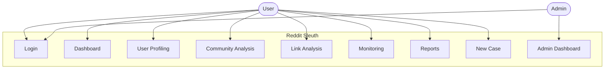

# Use Case Diagram - Reddit Sleuth

## Actors
- **User**: Performs investigations and analysis
- **Admin**: Manages system and users

## Use Cases
1. **Login**: User authentication
2. **Dashboard**: View case overview and stats
3. **User Profiling**: Analyze Reddit user behavior
4. **Community Analysis**: Analyze subreddits
5. **Link Analysis**: Track link relationships
6. **Monitoring**: Real-time content monitoring
7. **Reports**: Generate analysis reports
8. **New Case**: Create investigation cases
9. **Admin Dashboard**: User management (admin only)
