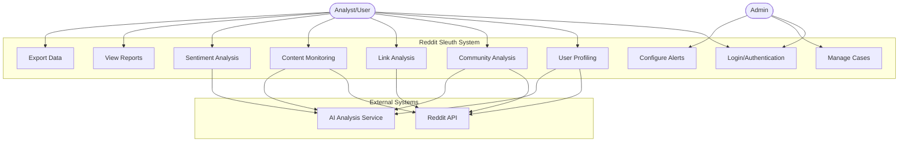

# Use Case Diagram - Reddit Sleuth

This diagram shows the main actors and their interactions with the Reddit Sleuth system.

## Actors

- **Admin**: System administrator with full access to configure monitoring and manage cases
- **Analyst/User**: Regular user who performs investigations and analysis

## Use Cases

1. **Login/Authentication**: User logs into the system
2. **User Profiling**: Analyze Reddit user behavior and patterns
3. **Community Analysis**: Analyze subreddit communities
4. **Link Analysis**: Track and analyze link relationships
5. **Content Monitoring**: Monitor keywords and posts in real-time
6. **Sentiment Analysis**: Analyze sentiment of posts and comments
7. **View Reports**: Generate and view analysis reports
8. **Manage Cases**: Create and manage investigation cases
9. **Export Data**: Export analysis results
10. **Configure Alerts**: Set up monitoring alerts
