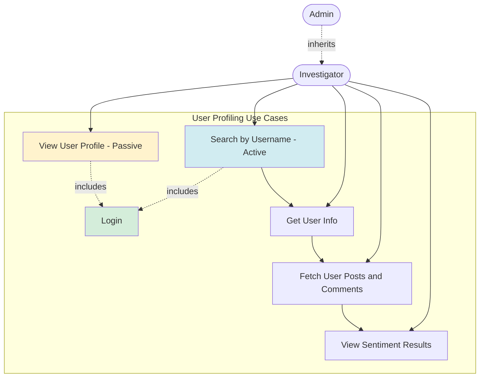
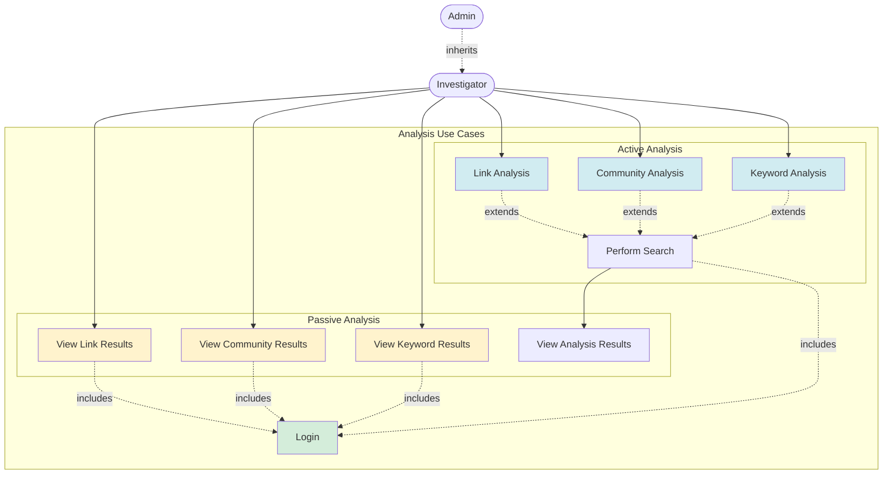
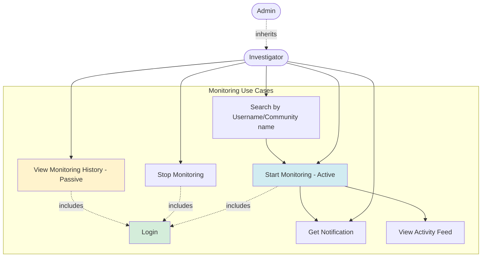
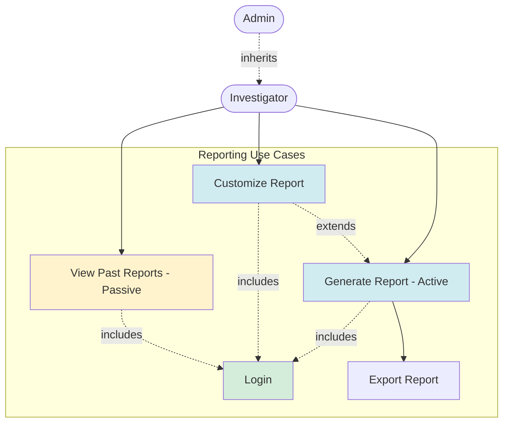
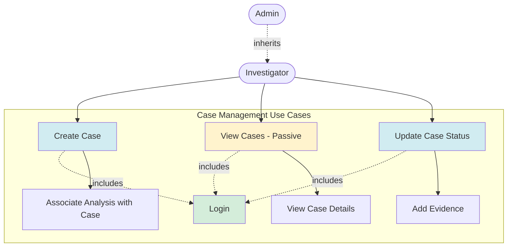
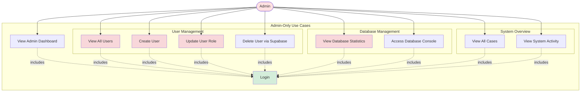

# Corrected Use Case Diagrams - Reddit Sleuth

## Complete System Use Case Diagram

```mermaid
graph TB
    %% Actors
    Guest([Guest])
    Investigator([Investigator])
    Admin([Admin])
    
    %% Actor inheritance
    Admin -.inherits.-> Investigator
    
    %% Authentication Use Cases
    Login[Login]
    Register[Register]
    Logout[Logout]
    
    %% Dashboard
    ViewDashboard[View Dashboard]
    
    %% User Profiling
    SearchUser[Search Reddit User - Active]
    ViewUserProfile[View User Profile - Passive]
    
    %% Community Analysis
    AnalyzeCommunity[Analyze Community - Active]
    ViewCommunityResults[View Community Results - Passive]
    
    %% Link Analysis
    PerformLinkAnalysis[Perform Link Analysis - Active]
    ViewLinkResults[View Link Analysis - Passive]
    
    %% Monitoring
    StartMonitoring[Start Monitoring - Active]
    StopMonitoring[Stop Monitoring]
    ViewMonitoringHistory[View Monitoring History - Passive]
    
    %% Reporting
    GenerateReport[Generate Report - Active]
    CustomizeReport[Customize Report]
    ViewPastReports[View Past Reports - Passive]
    
    %% Case Management
    CreateCase[Create Case]
    ViewCases[View Cases - Passive]
    UpdateCaseStatus[Update Case Status]
    
    %% Admin-Only Use Cases
    ViewAllUsers[View All Users - Admin]
    CreateUser[Create User - Admin]
    UpdateUserRole[Update User Role - Admin]
    ViewDatabaseStats[View Database Statistics - Admin]
    
    %% Guest connections
    Guest --> Register
    Guest --> Login
    
    %% Investigator connections
    Investigator --> Login
    Investigator --> Logout
    Investigator --> ViewDashboard
    Investigator --> SearchUser
    Investigator --> ViewUserProfile
    Investigator --> AnalyzeCommunity
    Investigator --> ViewCommunityResults
    Investigator --> PerformLinkAnalysis
    Investigator --> ViewLinkResults
    Investigator --> StartMonitoring
    Investigator --> StopMonitoring
    Investigator --> ViewMonitoringHistory
    Investigator --> GenerateReport
    Investigator --> CustomizeReport
    Investigator --> ViewPastReports
    Investigator --> CreateCase
    Investigator --> ViewCases
    Investigator --> UpdateCaseStatus
    
    %% Admin-specific connections
    Admin --> ViewAllUsers
    Admin --> CreateUser
    Admin --> UpdateUserRole
    Admin --> ViewDatabaseStats
    
    %% Include relationships - all authenticated actions include Login
    SearchUser -.includes.-> Login
    ViewUserProfile -.includes.-> Login
    AnalyzeCommunity -.includes.-> Login
    ViewCommunityResults -.includes.-> Login
    PerformLinkAnalysis -.includes.-> Login
    ViewLinkResults -.includes.-> Login
    StartMonitoring -.includes.-> Login
    StopMonitoring -.includes.-> Login
    ViewMonitoringHistory -.includes.-> Login
    GenerateReport -.includes.-> Login
    CustomizeReport -.includes.-> Login
    ViewPastReports -.includes.-> Login
    CreateCase -.includes.-> Login
    ViewCases -.includes.-> Login
    UpdateCaseStatus -.includes.-> Login
    ViewDashboard -.includes.-> Login
    Logout -.includes.-> Login
    ViewAllUsers -.includes.-> Login
    CreateUser -.includes.-> Login
    UpdateUserRole -.includes.-> Login
    ViewDatabaseStats -.includes.-> Login
    
    %% Extends relationships
    CustomizeReport -.extends.-> GenerateReport
    
    style Guest fill:#e1f5ff
    style Investigator fill:#fff4e1
    style Admin fill:#ffe1e1
    style Login fill:#d4edda
    style ViewAllUsers fill:#f8d7da
    style CreateUser fill:#f8d7da
    style UpdateUserRole fill:#f8d7da
    style ViewDatabaseStats fill:#f8d7da
```

## User Profiling Module

## Analysis Module

## Monitoring Module

## Reporting Module

## Case Management Module

## Admin Dashboard Module

## Legend

### Actor Colors
- 🔵 **Guest** (Light Blue): Unauthenticated users
- 🟡 **Investigator** (Light Yellow): Regular authenticated users
- 🔴 **Admin** (Light Red): Administrators with elevated privileges

### Use Case Colors
- 🔵 **Active Use Cases** (Light Blue): Trigger new actions, analysis, or data collection
- 🟡 **Passive Use Cases** (Light Yellow): View existing data without new operations
- 🟢 **Authentication** (Light Green): Login/authentication required
- 🔴 **Admin-Only** (Light Red): Restricted to administrators

### Relationships
- **Solid Arrow** (`-->`) : Direct association between actor and use case
- **Dotted Arrow with "includes"** (`-.includes.->`) : Required dependency
- **Dotted Arrow with "extends"** (`-.extends.->`) : Optional extension
- **Dotted Arrow with "inherits"** (`-.inherits.->`) : Actor inheritance

## Key Improvements

### 1. Complete Actor Coverage
- ✅ **Guest**: Registration and login
- ✅ **Investigator**: All analysis and monitoring features
- ✅ **Admin**: User management + all Investigator capabilities (inheritance)

### 2. Active vs Passive Use Cases
- ✅ **Active** (Blue): Perform new searches, start monitoring, generate reports
- ✅ **Passive** (Yellow): View existing profiles, browse history, access stored data

### 3. Proper Authentication Flow
- ✅ All authenticated use cases `<<include>>` Login
- ✅ Login is a foundational use case, not redundantly attached to each module

### 4. Admin-Specific Features
- ✅ User management (view, create, update roles)
- ✅ Database statistics and oversight
- ✅ System-wide case and activity views

### 5. Case Management
- ✅ Create and manage investigation cases
- ✅ Associate evidence and analysis with cases
- ✅ Track case status and progress
